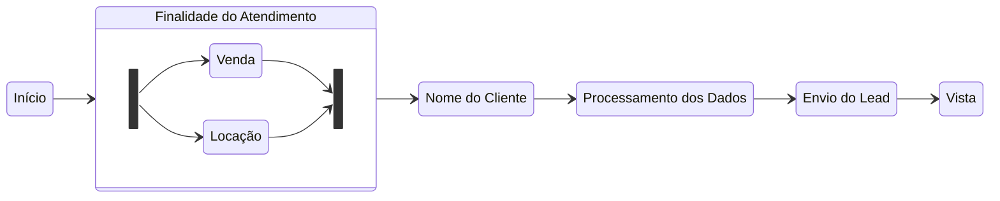

# TECNOLOGIAS LEADZ - CMSOUZA

[  I. ESCOPO](https://github.com/pepeleascov/cmsouza#i-escopo-desta-documenta%C3%A7%C3%A3o)<br />
[ II. PORTAIS](https://github.com/pepeleascov/cmsouza#ii-portais)<br />
[III. SITE](https://github.com/pepeleascov/cmsouza#iii-site)<br />
[ IV. CHATBOT](https://github.com/pepeleascov/cmsouza#iv-chatbot)<br />
[  V. BACKUP - IMÓVEIS](https://github.com/pepeleascov/cmsouza#v-backup---c%C3%B3pia-do-banco-de-im%C3%B3veis)<br />
[ VI. OTIMIZAÇÃO - IMAGENS](https://github.com/pepeleascov/cmsouza#vi-c%C3%B3pia-e-otimiza%C3%A7%C3%A3o-das-imagens-dos-im%C3%B3veis)<br />
[VII. SUPORTE](https://github.com/pepeleascov/cmsouza#vii-suporte)<br />
[ IV. NOTAS](https://github.com/pepeleascov/cmsouza#notas)<br />

--------

# I. ESCOPO DESTA DOCUMENTAÇÃO

Detalha o funcionamento e configuração da integração dos portais de imóveis com o Vista[^vista], campos de entrada de lead através do site, funcionamento e integração do chatbot[^chatbot], backup do banco de dados dos imóveis e do funcionamento da otimização das imagens dos imóveis para o CDN da Leadz[^cdn].

# II. PORTAIS

A integração com os portais com a roleta de atendimento do Vista[^vista] funciona configurando o envio de lead do portal para o e-mail "cmsouza@cmslead.com.br".[^cmslead] <br />
Uma vez que o servidor Leadz recebe o e-mail, ele o interpreta e extrai as informações necessárias para cadastrar o lead na roleta. <br />
Exemplo de lead interpretado e enviado para o Vista[^vista]:

    agencia: 1
    veiculo: GrupoZap
    mensagem:  Tenho interesse em visitar  
    nome: --nome do contato--
    fone: (43) 991##-####
    email: yohh.###@hotmail.com
    anuncio: 7230
    interesse: locação
    departamento: 12

A informação "departamento" segue a seguinte ordem:

    CMSOUZA VENDA: 11
    CMSOUZA LOCAÇÃO: 12
    CMSOUZA LANÇAMENTOS: 13

Os portais integrados são informados ao Vista[^vista] com as seguintes mídias de origem, sem espaços:

- GrupoZap
- VivaReal
- ChavesNaMão

Caso seja necessária a integração de um novo portal, favor fazer a solicitação através do e-mail: paulo@leadz.agency

# III. SITE

As entradas de lead através do site são:

- Página do imóvel - Agendamento de Visitas:

Os contatos de agendamento de horário para visitação entram para a roleta de atendimento do Vista[^vista] com a mídia de origem definida como "Site" e com o horário preenchido pelo cliente no campo "Mensagem".

- Barra de contatos:

Os contatos provenientes da opção "Enviar e-mail para CMSouza" na barra de contatos entram para a roleta de atendimento do Vista[^vista] com a mídia de origem definida como "Site" e com a mensagem preenchida pelo cliente no campo "Mensagem". Este lead será direcionado ao departamento de acordo com a seleção da finalidade do contato, sendo ela "Venda" ou "Locação".

Os contatos provenientes da opção "Atendimento por WhatsApp" na barra de contatos redirecionam o cliente para o atendimento através do chatbot[^chatbot] (detalhado na seção seguinte), entram para a roleta de atendimento do Vista[^vista] com a mídia de origem definida como "Site-Whatsapp", e com a mensagem enviada pelo cliente incluída no campo "mensagem".

- Configurando os imóveis na categoria "Exclusividade Vectra Construtora":
É necessário que o EMPREENDIMENTO esteja cadastrado no CRM na categoria **EMPREENDIMENTO** e com os checkboxes **"Exibir no Site"** e **"Exclusividade"** marcados. Os **EMPREENDIMENTOS** não são exibidos na pesquisa de **IMÓVEIS.**
- [x] Exibir no Site
- [x] Lançamento


- Trabalhe Conosco:
O cadastro do currículo captado pela página é enviado para o e-mail "contato@cmsouza.com.br" com os seguintes dados:
Assunto: Novo Currículo
As informações de Nome, E-mail e Telefone vão no corpo do e-mail com o currículo anexo

- Anuncie seu Imóvel:
As informações captadas nesta página são direcionadas à roleta de atendimento e direcionado ao departamento de acordo com o interesse selecionado. Este contato vai com a mensagem "Tenho interesse em anunciar meu imóvel" cadastrada no lead.

# IV. CHATBOT

Nosso sistema (Leadz) atua em conjunto com o serviço contratado "Sendpulse"[^chatbot], utilizando o chatbot como forma de entrada de dados. O chatbot faz a interação com o usuário durante o atendimento dos leads no WhatsApp, onde posteriormente nosso sistema os envia para a roleta de atendimento do Vista[^vista]. <br />
Para os contatos provenientes dos portais, nosso sistema identifica os links dentro das mensagens e classifica a mídia de origem de acordo com o link do portal.
Dessa forma, os leads dos portais atendidos através do WhatsApp são enviados para a roleta de atendimento com uma das seguintes mídias de origem:

    GrupoZap-Whatsapp
    VivaReal-Whatsapp
    ChavesNaMão-Whatsapp

Os outros contatos provenientes da opção "Atendimento por WhatsApp" da barra de contatos do site da CMSouza são classificados com a mídia de origem "Site-Whatsapp". <br />
O nosso sistema, em conjunto com o chatbot[^chatbot], armazena as mensagens recebidas durante a interação do chat e ao final as envia no campo "mensagem" do lead a ser cadastrado na roleta de atendimento.

O fluxo de atendimento funciona da seguinte forma:

    1. Início do atendimento
    2. Usuário seleciona a finalidade do atendimento, que indica a informação do departamento
    3. Usuário responde o nome
    4. O processamento dos dados é iniciado assim que o servidor recebe a resposta do "nome"
    5. Após, o nosso sistema faz o envio do lead para a roleta do Vista

Diagrama:



Exemplo de lead enviado através do chatbot:

```
nome: --nome do contato--
fone: 5543#####
mensagem: Olá! Gostaria de falar com um corretor sobre o imóvel 8746
veiculo: Site-Whatsapp
interesse: Locação
departamento: 12
agencia:1
```

*O imóvel de interesse, neste caso, não é enviado ao o Vista[^vista]. <br />
Ver nota[^imovel]: Sendo implementado, não será necessário perguntar a finalidade do atendimento, uma vez que com o código do imóvel conseguimos programar o servidor para pesquisar o referido imóvel no Vista e alimentar o lead com as informações antes de fazer o envio à roleta de atendimento.

# V. BACKUP - CÓPIA DO BANCO DE IMÓVEIS

A cópia/backup do banco de imóveis salva apenas as informações que são pertinentes ao funcionamento do site. O backup não salva o banco de dados dos imóveis em sua totalidade e não tem acesso à outras informações do CRM NovoVista[^vista], como por exemplo, cadastro de clientes e negócios. <br />
O intuito dessa cópia é para que o site não dependa do sistema do Novo Vista[^vista], que esporadicamente apresenta instabilidades e lentidão. A cópia ocorre todos os dias, de hora em hora e leva cerca de 15 minutos para finalizar e atualizar. Portanto, as atualizações de descrição e o cadastro de novos imóveis pode levar até uma hora para estarem disponíveis no site da CMSouza.

As informações dos imóveis que são salvas são as seguintes:

    Status, Finalidade, Categoria, Codigo, BairroComercial, Bairro, Empreendimento, Cidade, 
    ValorVenda, ValorLocacao, Dormitorios, Caracteristicas, InfraEstrutura, CodigoEmpreendimento,
    BanheiroSocialQtd, Vagas, AreaPrivativa, AreaTotal, ValorCondominio, DescricaoWeb, 
    DescricaoEmpreendimento, Imediacoes, DestaqueWeb, SuperDestaqueWeb, Lancamento, Tour360, 
    Corretor, TotalBanheiros, Suites, Endereco, Numero, UF, FotoDestaque


# VI. CÓPIA E OTIMIZAÇÃO DAS IMAGENS DOS IMÓVEIS

As fotos dos imóveis também passam por uma otimização em nosso servidor, e, posteriormente, é replicada para o nosso CDN[^cdn]. <br />
Com isso, reduzimos o tempo médio de carregamento de cada imagem do imóvel em aproximadamente 80%, indo de ~300ms[^~] [^ms] para cerca de ~60ms[^ms]. Isso equivale a um carregamento de imagens 4 vezes mais rápida em comparação ao CDN[^cdn] do Vista[^vista]. <br />
O objetivo desta otimização e posterior entrega das imagens ao CDN da Leadz, além de tornar o carregamento das imagens do site da CMSouza mais rápido, é torná-lo independente do Novo Vista, evitando assim, os períodos de instabilidade que já passamos.

# VII. SUPORTE

[paulo@leadz.agency](mailto:paulo@leadz.agency) <br />
(43) 99969-6665 <br />
[michael@leadz.agency](mailto:michael@leadz.agency) <br />

### Última Atualização
21/10/2022

<!-- 
#### ToDo:
- [x] Esta documentação
- [ ] Detalhar o funcionamento do site em si
- [ ] Interpretação de texto do lead do chatbot para identificar o imóvel de interesse
- [ ] Criação da ferramenta de relatório de leads recebidos
-->

#### NOTAS
[^chatbot]: [Chatbot - Sendpulse](https://sendpulse.com)
[^cdn]: CDN - Content Delivery Network / Rede de entrega de conteúdo
[^cmslead]: CMSLEAD - Sistema criado para recebimento e interpretação dos e-mails de portais
[^ms]: milisegundos
[^imovel]: Há essa possibilidade, mas será necessário adicionar uma etapa de interpretação de mensagem para identificar o imóvel.
[^~]: ∼ (aproximação, similaridade, equipolência);
[^vista]: [NovoVista](http://www.vistasoft.com.br/)